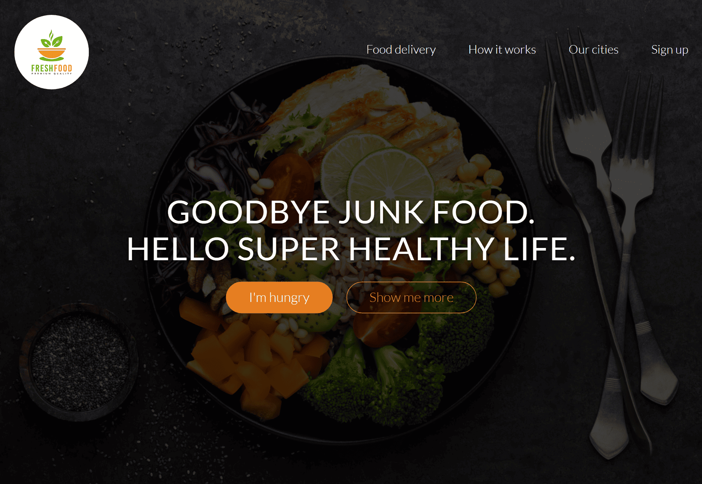

# FreshFood Healthy Meals
FreshFood is a responsive food delivery website designed to promote healthy, organic meals.
The project focuses on clean UI, smooth animations, and user-friendly navigation. It includes sections like features, meal showcase, working process, city availability, pricing plans, testimonials, and a contact form.
---
# Tech Stack
- HTML5 – Structure and semantic layout
- CSS3 – Styling, responsiveness, and animations
- JavaScript – Interactivity and dynamic behavior
- jQuery – Smooth scrolling and DOM manipulation
- AOS (Animate on Scroll) – Scroll animations
- Ionicons – Icons and UI enhancement

# Screenshot 


# Features
- Responsive and mobile-friendly design
- Smooth scrolling navigation
- Scroll-based animations (AOS)
- Meal showcase gallery
- City-wise service availability
- Subscription pricing plans
- Customer testimonials section
- Contact & feedback form

# Project-Structure
```
FreshFood/
├── resources/          → Main project assets
│   ├── css/            → Custom styling files (main design)
│   └── img/            → Images, logos, food photos, UI assets
│
├── vendors/            → Third-party resources
│   └── css/            → Media queries & responsive layout files
```
## Contributing

1. Fork the repository
2. Create a branch:

```bash
git checkout -b feature/new-feature
```

3. Commit your changes:

```bash
git commit -m "Add new feature"
```

4. Push and open a Pull Request:

```bash
git push origin feature/new-feature
```
## License

This project is licensed under the **MIT License**.

## Contact

Maintainer: [@AayushiSinha-2005](https://github.com/AayushiSinha-2005)
Email: [jiyasinha2055@gmail.com](mailto:jiyasinha2055@gmail.com)

<p align="center">
  <sub>Developed and maintained with ❤️ by the <a href="mailto:jiyasinha2055@gmail.com">Aayushi Sinha</a>.</sub>
</p>